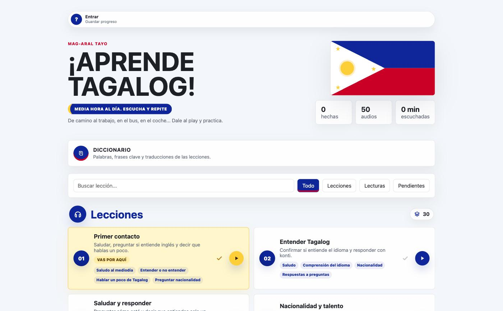
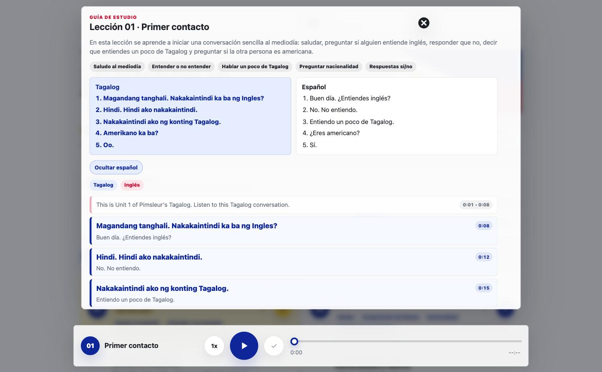
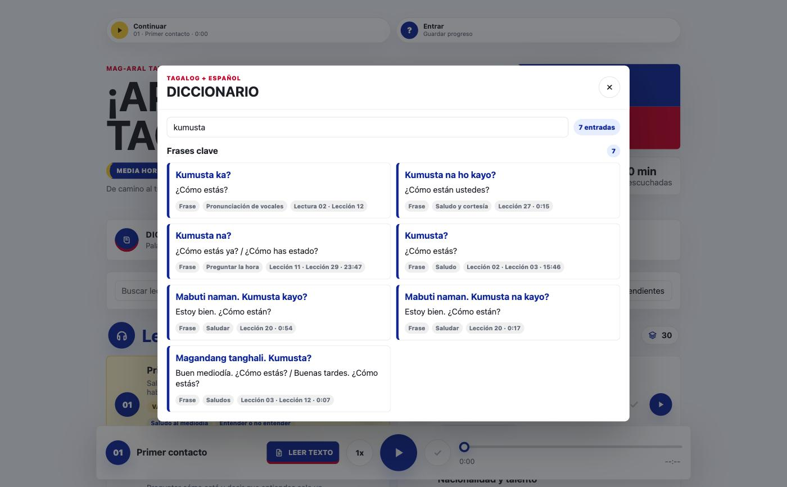
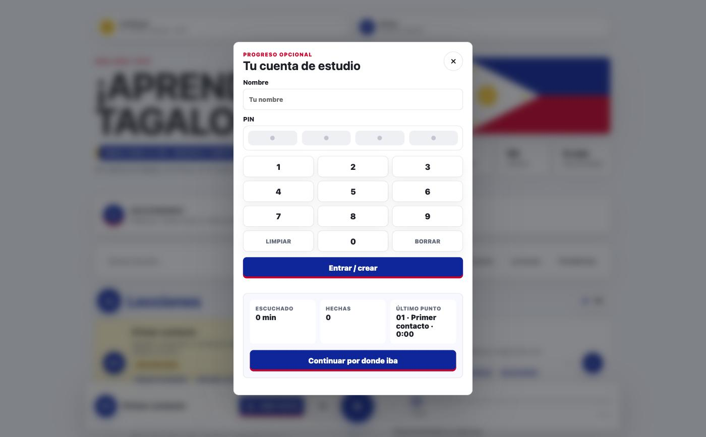

# Aprende Tagalog

> Media hora al día. Solo escuchar y repetir.

Reproductor web para estudiar Tagalog con audio, transcripción sincronizada,
traducción al español y diccionario buscador. Está pensado para usarse **de
camino al trabajo**: darle al play en el bus o en el coche y practicar.

En producción: **https://misioncebu.org/tagalog/**



---

## QUÉ ES ESTO EXACTAMENTE

Hay muchos cursos de idiomas en audio, pero casi ninguno te deja **leer lo
que estás oyendo**. Este proyecto resuelve eso.

Coges una carpeta de MP3 de un curso de idiomas y un pipeline automático te
devuelve una aplicación web completa:

1. **Transcribe** el audio con Whisper, con marcas de tiempo por segmento.
2. **Enriquece** cada segmento con IA: detecta el idioma, traduce al español
   y añade una nota gramatical.
3. **Construye un diccionario** cruzando todas las lecciones, con filtros
   heurísticos para tirar el ruido en inglés.
4. **Sirve** una web estática que reproduce, resalta la frase que suena en
   ese momento y permite saltar a cualquier punto tocando el texto.

El repositorio publica **el motor**. El contenido (audio y transcripciones)
no se distribuye — ver [Licencia y contenido](#licencia-y-contenido).

---

## LO QUE HACE

### Reproductor
Barra fija abajo, siempre accesible. Play/pausa, anterior/siguiente,
velocidad de 0.75x a 1.5x, barra de progreso arrastrable e integración con
**MediaSession**: sale en la pantalla de bloqueo del móvil y responde a los
botones del coche o de los auriculares.

### Transcripción sincronizada


Cada frase está etiquetada por idioma (Tagalog / Inglés) y lleva su
traducción al español debajo. **La frase que está sonando se resalta sola** y
el panel hace scroll para seguirla. Tocas cualquier frase y el audio salta a
ese segundo exacto.

Arriba de todo, una **guía de estudio** generada por IA: un resumen de una
frase, las etiquetas de los temas que se tratan y el diálogo completo de la
lección en dos columnas (Tagalog / Español).

### Diccionario


**2.548 entradas** extraídas automáticamente de las 50 pistas, agrupadas en
palabras, frases clave y frases largas. Buscas "kumusta" y ves todas las
variantes con su traducción y **en qué lección y en qué minuto aparecen**.

### Cuenta con PIN y progreso sincronizado


Sin email, sin contraseña, sin registro. Nombre + PIN de 4 dígitos y ya.
El progreso (lecciones hechas, minutos escuchados, posición exacta en cada
audio) se guarda en `localStorage` y, si entras con cuenta, se sincroniza
contra el servidor con una **estrategia de fusión** que combina lo local y
lo remoto en vez de pisar uno con otro. Así puedes empezar en el móvil y
seguir en el ordenador.

El botón **Continuar** de arriba te devuelve al segundo exacto donde lo
dejaste.

### Y además
- **Funciona sin cuenta.** Todo lo anterior menos la sincronización entre
  dispositivos va con `localStorage`. La cuenta es opcional de verdad.
- **Filtros y buscador** por lecciones, lecturas o pendientes.
- **Cero dependencias.** No hay React, ni build, ni `npm install`. Es
  HTML + CSS + JavaScript vanilla. Se despliega copiando archivos.

---

## CIFRAS DEL PROYECTO

| | |
|---|---|
| Pistas de audio | 50 (30 lecciones + 20 lecturas) |
| Audio procesado | ~1,3 GB |
| Caracteres transcritos | 299.480 |
| Segmentos con marca de tiempo | 11.781 |
| Entradas de diccionario | 2.548 |
| Líneas de código | ~5.900 |
| Dependencias de frontend | 0 |

---

## ESTRUCTURA

```
app/
├── index.html              Una sola página, sin framework
├── app.js                  1.928 líneas: player, transcripción,
│                           diccionario, cuenta y sincronización
├── styles.css              2.639 líneas: sistema de diseño propio
│                           con los colores de la bandera filipina
├── api.php                 Backend de cuentas y progreso (ver docs/04)
├── .htaccess               noindex + sin listado de directorios
│
├── scripts/
│   ├── transcribe_tagalog.py   Audio  ->  transcripts/raw/
│   ├── enrich_transcripts.py   raw    ->  transcripts/enriched/
│   └── build_dictionary.py     enriched -> dictionary.json
│
├── docs/                   Documentación completa (empieza por 01)
├── screenshots/            Capturas de producción
│
├── audio/                  [NO EN GIT] symlink a los MP3 fuente
└── transcripts/            [NO EN GIT] datos generados
```

---

## CÓMO SE USA CON TU PROPIO AUDIO

Necesitas `python3`, `ffmpeg` y una API key de OpenAI.

```bash
# 0. Pon tus MP3 en audio/ y guarda la key
mkdir -p ~/.config/victor && echo "sk-..." > ~/.config/victor/openai_api_key

# 1. Transcribir (trocea a 8 min por el límite de 25 MB de la API)
python3 scripts/transcribe_tagalog.py --all

# 2. Enriquecer: idioma, traducción ES, nota gramatical y guía de estudio
python3 scripts/enrich_transcripts.py --all

# 3. Construir el diccionario cruzado
python3 scripts/build_dictionary.py

# 4. Servir en local
python3 -m http.server 8000
```

Los tres scripts **cachean por archivo**: si se cae a mitad, relanzas y
retoma donde iba. Nada se recalcula sin `--force`.

Detalle completo en **[docs/02-pipeline-datos.md](docs/02-pipeline-datos.md)**.

---

## DOCUMENTACIÓN

| Documento | De qué va |
|---|---|
| [01 · Arquitectura](docs/01-arquitectura.md) | Visión general y por qué está hecho así |
| [02 · Pipeline de datos](docs/02-pipeline-datos.md) | Los tres scripts, sus formatos y sus trucos |
| [03 · Frontend](docs/03-frontend.md) | Estado, render, sincronización de transcripción, diseño |
| [04 · Backend y API](docs/04-backend-api.md) | Cuentas con PIN, contrato de la API, fusión de progreso |
| [05 · Despliegue](docs/05-despliegue.md) | Servidor, rsync, cache busting |
| [06 · Historia](docs/06-historia-del-proyecto.md) | Cómo se construyó, decisiones y callejones sin salida |
| [07 · Roadmap](docs/07-roadmap.md) | Mejoras pendientes, priorizadas |
| [CHANGELOG](CHANGELOG.md) | Qué se ha ido subiendo y cuándo |
| [CLAUDE.md](CLAUDE.md) | Contexto para trabajar con Claude Code en este repo |

---

## LICENCIA Y CONTENIDO

El **código** es MIT. Úsalo, cámbialo, véndelo.

El **contenido** no se distribuye. Este repositorio **no incluye** los MP3
del curso, ni las transcripciones, ni el diccionario generado: son obra
derivada de material comercial con derechos de autor. Están en `.gitignore`
y viven solo en local y en el servidor privado.

Si quieres usar esto, aporta tu propio audio y asegúrate de tener derecho a
usarlo. La instalación en producción es privada y va con `noindex, nofollow,
noarchive` precisamente por esto.

---

Hecho por [Víctor Córdoba](https://victorcordoba.com/) con [Claude Code](https://claude.com/claude-code).
