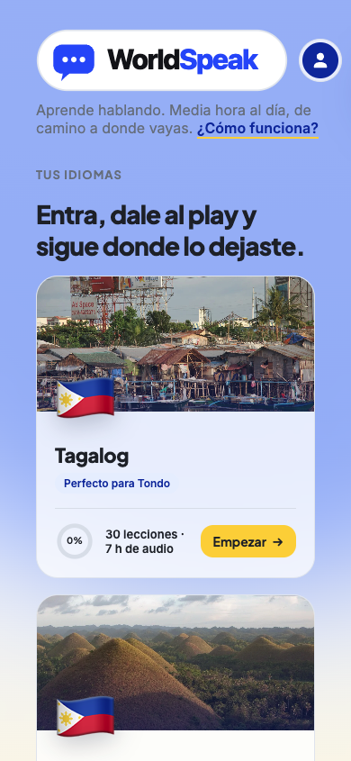
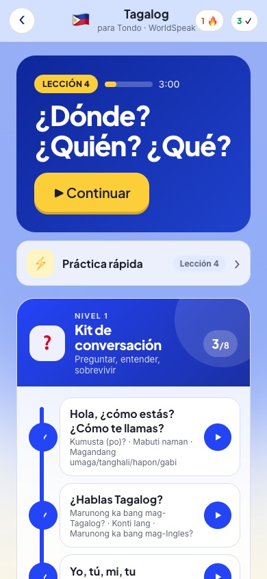
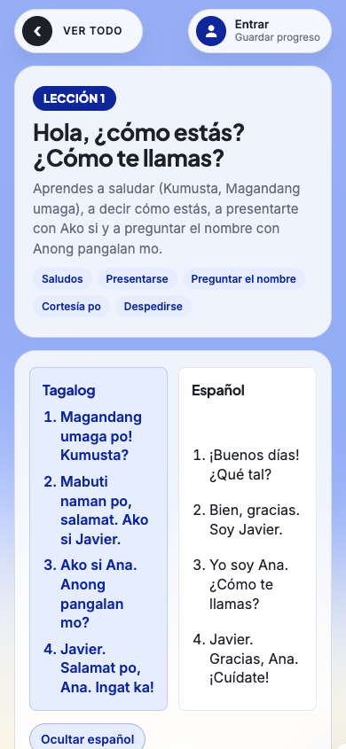
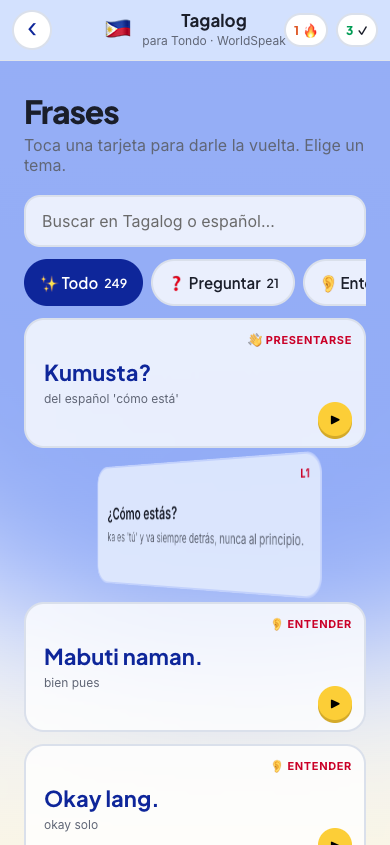
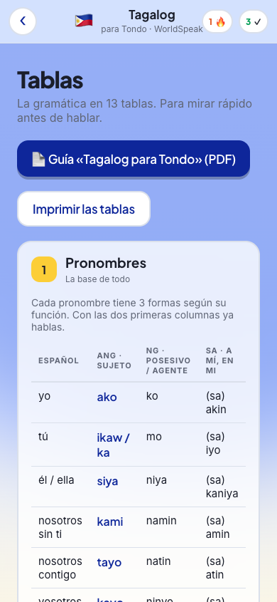
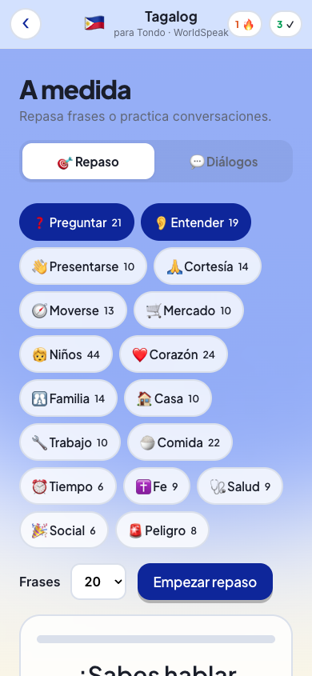
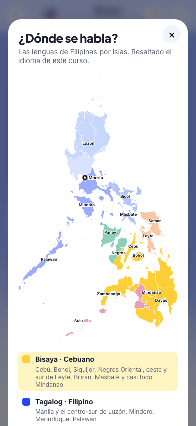

<p align="center">
  <a href="https://worldspeak.es/"></a>
</p>

<h1 align="center">WorldSpeak</h1>

<p align="center"><strong>Aprende idiomas escuchando y repitiendo. Media hora al día.</strong></p>

<p align="center">
  <a href="https://worldspeak.es/"></a>
</p>

<p align="center">
  <a href="https://worldspeak.es/about/">Sobre WorldSpeak</a> ·
  <a href="https://worldspeak.es/tagalog/">Tagalog para Tondo</a> ·
  <a href="https://worldspeak.es/tagalog-pimsleur/">Tagalog Pimsleur</a> ·
  <a href="docs/00-metodo-tondo.md">El Método Tondo</a> ·
  <a href="docs/10-plan-tagalog-propio.md">Plan del curso propio</a> ·
  <a href="CHANGELOG.md">Changelog</a>
</p>

<p align="center">
  
  
  
  
</p>
<p align="center">
  
  
  
</p>

Plataforma web para estudiar idiomas con el **Método Tondo** (Pimsleur llevado al móvil): audio,
transcripción sincronizada, traducción al español y diccionario. Un hub con
varios cursos y **una sola cuenta** cuyo progreso te sigue del móvil al
ordenador. Y un **sistema modular de contenido** que compila lecciones de
5, 15 o 30 minutos a partir de frases reutilizables, con voces nativas de
ElevenLabs.

---

## QUÉ HAY DENTRO

**Un hub** (`/worldspeak/`) con todos los idiomas y tu progreso en cada uno.

**Un reproductor genérico** que no sabe nada de ningún idioma: cada curso es
una carpeta con un `course.json` y sus datos. Añadir un idioma es añadir una
carpeta.

**Dos maneras de crear un curso:**

1. **A partir de audio existente** (así nació el proyecto, con el Tagalog de
   Pimsleur): Whisper transcribe con tiempos, GPT enriquece con idioma,
   traducción y notas, y un script construye el diccionario.
2. **Desde cero, con voces generadas** (los cursos propios): GPT escribe el
   guion siguiendo el método Pimsleur, ElevenLabs pone voz de narrador en
   español y de nativos, ffmpeg monta el audio con las pausas para repetir, y
   como el guion es nuestro, **la transcripción sale exacta y gratis**, sin
   Whisper.

**Una cuenta con nombre + PIN**, sin email ni registro, con progreso por curso
sincronizado por fusión (nunca se pierde nada).

---

## CURSOS

| Curso | Ruta | Origen | Estado |
|---|---|---|---|
| Tagalog · Pimsleur | `/worldspeak/tagalog-pimsleur/` | Audio de Pimsleur (30 lecciones + 20 lecturas), transcrito | Completo |
| Tagalog para Tondo | `/tagalog/` | Propio: 30 lecciones, voces Fish/ElevenLabs, frases, tablas, práctica | Completo |
| Bisaya para Cebú y Bohol | `/bisaya/` | Propio: 30 lecciones | Completo |
| Italiano · Ser romano | `/italiano/` | Propio: 30 lecciones (Vespa, bar, arte, calcio) | Completo |
| Portugués · Surf y gloria | `/portugues/` | Textos de 30 lecciones; L01 con voz | En preparación |
| Inglés británico | `/ingles/` | Textos de 30 lecciones; L01 con voz | En preparación |
| Francés | `/frances/` | Textos de 30 lecciones; L01 con voz | En preparación |

---

## LO QUE HACE EL REPRODUCTOR

- Barra fija con play, anterior/siguiente, velocidad 0.75x a 1.5x, progreso
  arrastrable y **MediaSession** (pantalla de bloqueo, CarPlay, Android Auto).
- **Transcripción sincronizada**: la frase que suena se resalta sola; tocas una
  frase y el audio salta a ese segundo.
- **Guía de estudio** por lección: resumen, temas y diálogo en dos columnas.
- **Diccionario** buscable con la lección y el minuto donde aparece cada entrada.
- **Continuar donde ibas**, posición guardada por pista, minutos escuchados.
- Funciona sin cuenta con `localStorage`; con cuenta, sincroniza entre dispositivos.
- Cero dependencias. HTML + CSS + JS. Se despliega copiando archivos.

---

## ESTRUCTURA

```
web/                         Lo que se despliega a /worldspeak
├── index.html courses.json  Hub
├── assets/                  player.js (genérico), boot.js, player.css, hub.js, hub.css
├── api/                     index.php (PDO: MySQL o SQLite), schema.*.sql, migrate_legacy_users.php
├── tagalog-pimsleur/        index.html course.json  [audio/ y transcripts/ fuera de git]
└── tagalog/                 index.html course.json scripts/ transcripts/  [audio/ y _clips/ fuera de git]

pipeline/                    Curso a partir de audio existente
├── transcribe.py            Whisper con tiempos, troceado a 8 min      --course X
├── enrich.py                Idioma, traducción, notas, guía de estudio  --course X
└── build_dictionary.py      Diccionario cruzado, sin API               --course X

pipeline/voice/              Curso desde cero con ElevenLabs
├── voices.json              Voces por rol (narrador ES, nativo/a)
├── write_script.py          GPT escribe el guion Pimsleur (JSON de cues con pausas)
├── synth.py                 Un clip por cue, cacheado por hash
├── assemble.py              ffmpeg + transcripts con tiempos exactos + course.json
└── generate_lesson.py       Orquesta todo lo anterior

scripts/deploy.sh            rsync a Hostinger
docs/                        Documentación (empieza por 08)
```

---

## CREAR UNA LECCIÓN NUEVA

```bash
export PATH=/opt/homebrew/bin:$PATH        # ffmpeg
cd pipeline/voice
python3 generate_lesson.py --course tagalog --lesson 2 --minutes 25 \
  --theme "Presentarse y preguntar de dónde eres" --dry-run     # cuenta caracteres sin gastar
python3 generate_lesson.py --course tagalog --lesson 2 --minutes 25 \
  --theme "Presentarse y preguntar de dónde eres"               # genera
../../scripts/deploy.sh
rsync -az ../../web/tagalog/audio/ PERSONAL_SERVER:~/domains/victorcordoba.com/public_html/worldspeak/tagalog/audio/
```

Claves en `~/.config/victor/openai_api_key` y `~/.config/victor/elevenlabs_api_key`.

---

## DOCUMENTACIÓN

| Documento | De qué va |
|---|---|
| [00 · El Método Tondo](docs/00-metodo-tondo.md) | **El método**: principios, la lección minuto a minuto, repetición, speakers, tablas, práctica |
| [08 · WorldSpeak](docs/08-worldspeak.md) | **Empieza aquí** para el código. Hub, cursos, player genérico, API v2, migración |
| [09 · Pipeline de voz](docs/09-pipeline-voz.md) | Cómo se genera una lección Pimsleur con ElevenLabs |
| [01 · Arquitectura](docs/01-arquitectura.md) | La base: las dos mitades del sistema |
| [02 · Pipeline de datos](docs/02-pipeline-datos.md) | Whisper, enriquecido, diccionario |
| [03 · Frontend](docs/03-frontend.md) | Sincronización de transcripción, diseño |
| [04 · Backend y API](docs/04-backend-api.md) | Cuentas con PIN y fusión de progreso (v1, sigue vigente) |
| [05 · Despliegue](docs/05-despliegue.md) | Servidor y rsync |
| [06 · Historia](docs/06-historia-del-proyecto.md) | Cómo se construyó |
| [07 · Roadmap](docs/07-roadmap.md) | Qué falta |
| [14 · Guiones y textos](docs/14-guiones-y-textos.md) | Qué dice cada voz y de dónde sale cada texto |
| [15 · Errores y aprendizajes](docs/15-errores-y-aprendizajes.md) | Checklist reutilizable para cada idioma nuevo |
| [CHANGELOG](CHANGELOG.md) | Qué se ha subido y cuándo |
| [CLAUDE.md](CLAUDE.md) | Reglas para trabajar con Claude Code aquí |

---

## LICENCIA Y CONTENIDO

El **código** es MIT. El **audio de Pimsleur y sus transcripciones** no se
distribuyen (obra derivada con derechos de autor, en `.gitignore`). Los
**cursos propios** (guiones y transcripciones de `tagalog/`, `bisaya/`) son de
WorldSpeak y sí están en el repositorio. Las voces son de la Voice Library de
ElevenLabs, cedidas por sus dueños; **no se clonan voces de personas reales
sin su consentimiento**.

Hecho por [Víctor Córdoba](https://victorcordoba.com/) con [Claude Code](https://claude.com/claude-code).
